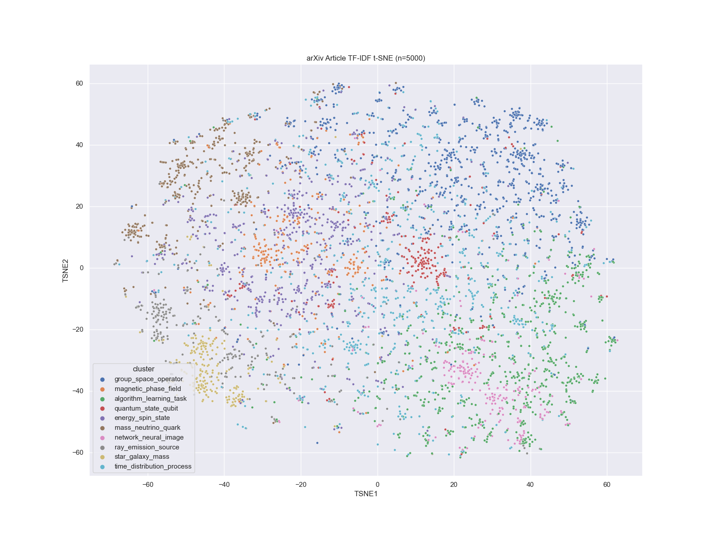

lit-embed
=========

Overview
--------



Pipeline to explore alternative approaches to scientific literature embeddings, 
detection of maximally informative terms associated with different areas of research,
and to infer and visualize a concept-concept network that refelects the topics of
research contained in the different bodies of research.

Two main sources of open data are explored:

1. [arXiv](https://arxiv.org/)
2. [Pubmed](https://pubmed.ncbi.nlm.nih.gov/) [not yet implemented]

_Figure_: arXiv TF-IDF t-SNE projected articles and clusters. For each cluster, the the
most frequent words associated with articles in the cluster are shown.

Learning Objective
------------------

One of the main goals of the analysis is to infer a highly compressed set of terms
(either words or named entities) which, when quantified across articles, is sufficient
to preserve much of the content of the relationships between articles.

This can be useful, for example, for inferring sets of human-interpretable "keywords"
associated with articles, in an unbiased manner.

In order to infer such a set of terms, a _baseline_ or _ground truth_ for "article
similarity" be defined.

There are at least a couple possible ways this can be assessed:

1. ~Jaccard index or cosine similarity of article term (word/named entity) vectors using
   a much large set of terms.
2. Overlap, etc. of neighbors in a citation network.

The preferred approach to use is still tbd.

Both of the above approaches for assessing ground truth article similarity have
drawbacks:

The first approach is essentially using the same approach we are attempting to optimize,
but simply with less regularization.

The second approach relies on _human interpretation_ of the relationship between
different topics, and may miss meaningful connections between topics, simply due to the
lack of collaboration across different sub-fields.

Setup
-----

To begin, create a [conda](https://docs.conda.io/en/latest/) environment with the
necessary requirements, using:

```
create create -n lit-embed --file requirements.txt
```

Usage
-----

To run the pipeline, activate the conda environment, and call `snakemake`, specifying
the desired number of threads to use with the `-j` option, e.g.:

```
conda activate lit-embed
snakemake -j8
```

