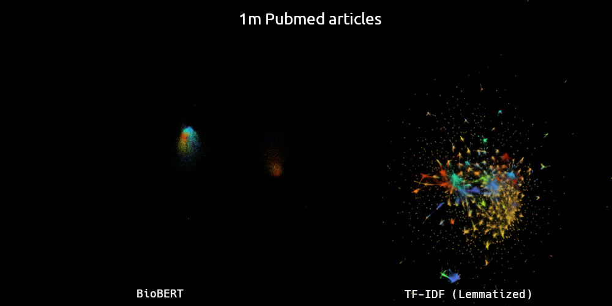

lit-embed
=========

Overview
--------



`lit-embed` is a computational pipeline developed to explore alternative approaches for
embedding science articles, to detect informative terms associated with different fields of 
research, and to infer and visualize a concept-concept network that reflects relationships between
different topics and fields of research.

Two main sources of open data are explored:

1. [arXiv](https://arxiv.org/)
2. [PubMed](https://pubmed.ncbi.nlm.nih.gov/)

_Figure_: Comparison of article embeddings generated using BioBERT (left) and TF-IDF
(right) for 1 million PubMed articles. Color corresponds to the cluster of the embedded
article.

Learning Objective
------------------

One of the main goals of the analysis is to infer a highly compressed set of terms
(either _words_ or _named entities_) which, when quantified across articles, is sufficient
to preserve much of the content of the relationships between articles.

This can be useful, for example, for inferring sets of human-interpretable "keywords"
associated with articles, in an unbiased manner.

In order to infer such a set of terms, a _baseline_ or _ground truth_ for "article
similarity" be defined.

There are at least a couple possible ways this can be assessed:

1. ~Jaccard index or cosine similarity of article term (word/named entity) vectors using
   a much large set of terms.
2. Overlap, etc. of neighbors in a citation network.

The preferred approach to use is still _tbd_.

Both of the above approaches for assessing ground truth article similarity have
drawbacks:

The first approach is essentially using the same approach we are attempting to optimize,
but simply with less regularization.

The second approach relies on _human interpretation_ of the relationship between
different topics, and may miss meaningful connections between topics, simply due to the
lack of collaboration across different sub-fields.

Setup
-----

To begin, create a [conda](https://docs.conda.io/en/latest/) environment with the
necessary requirements, using:

```
create create -n lit-embed --file requirements.txt
```

Next, copy of the example config files located in the `config/` dir and modify as desired:

```
cp config/pubmed.example.yml config/pubmed.yml
```

Data Preparation
----------------

In order to simplify the pipeline, and make it easier for one to use the PubMed / arXiv data even if
you aren't interested in this particular application, the PubMed/arXiv data download download &
pre-processing steps have been moved to separate dedicated pipelines:

1. [GitHub - lit-explore/pubmed: PubMed Data Preparation Pipeline](https://github.com/lit-explore/pubmed)
2. [GitHub - lit-explore/arxiv: arXiv Data Preparation Pipeline](https://github.com/lit-explore/arxiv)

The above pipelines download and process article texts into a simple tabular form, as well as
performing some basic filtering and cleaning. An optional lemmatization step is also provided to
generate a lemmatized version of the article texts.

See the READMEs for the above repos for instructions on how to download and prepare the data.

Once you have run through one or more of the above pipelines, you are ready to run this pipeline to
generate one or more embeddings for those datasets.

Usage
-----

To run the main pipeline, activate the conda environment and call `snakemake`, specifying the
location of the customized config file to use, as well as any other parameters relating to the
number of cores to use, etc.

For example:

```
conda activate lit-embed
snakemake -j8 --configfile config/arxiv.yml
```

A separate entry point also exists to construct [datashader](https://datashader.org/)
visualizations using large subsets of the UMAP article projections.

Because datashader depends on earlier versions of Python, a separate conda environment
has been specified for it, which Snakemake will automatically detect and use when the
`--use-conda` parameter is included:

```
snakemake -j1 --use-conda datashader
```

Due to scaling issues, the datashader rule is currently limited to UMAP projected data.

Related
-------

Related topics:

- topic modeling
- keyword / keyphrase detection
- document embedding
- SciBERT, BioBERT, etc.

Related efforts:

- [GitHub - allenai/scirepeval: SciRepEval benchmark training and evaluation scripts](https://github.com/allenai/scirepeval)
- [GitHub - allenai/specter: SPECTER: Document-level Representation Learning using Citation-informed Transformers](https://github.com/allenai/specter)
